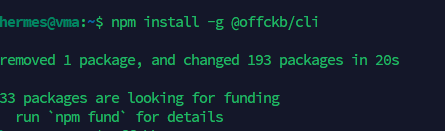
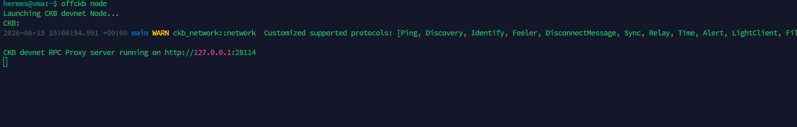
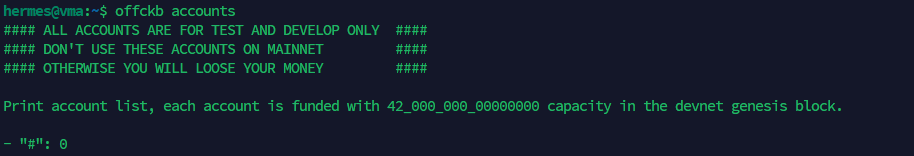
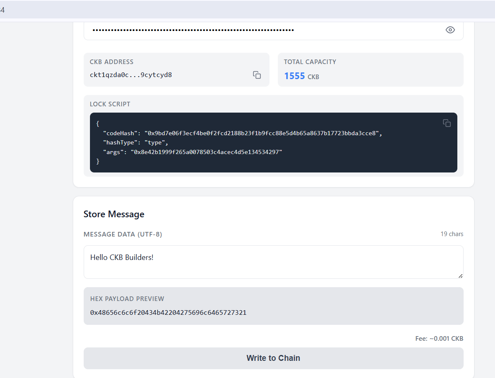

# CKB Store Data on Cell - Quest Proofs

Proof of completion for the CKB **Store Data on Cell** tutorial running on a local OffCKB devnet. 

---

## 1. OffCKB Environment Setup

### CLI Installation
Verified `@offckb/cli` installation.

### Running Local Devnet
Started the local CKB node.

### Pre-funded Accounts
Checked the genesis accounts to extract the private key for the dApp.

---

## 2. DApp Execution & Flow

### Start Frontend
Launched the local development server for the frontend application.

### Message Encode Preview
Inputting UTF-8 text and verifying the real-time Hex encoding preview before broadcasting.

### Transaction Building & Broadcast
Clicking **Write to Chain** compiles, signs, and broadcasts the transaction, dynamically showing the Transaction Hash.

### Cell Data Retrieval & Decode
Querying the Live Cell data via RPC and decoding the raw Hex payload back to the original text message.
