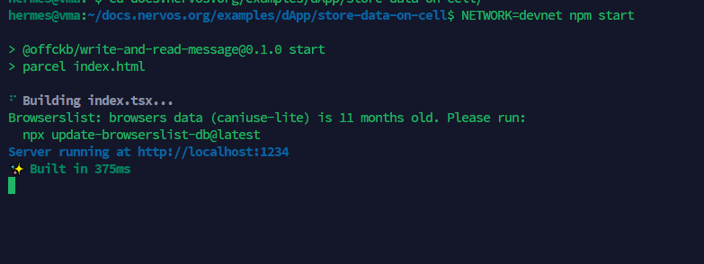
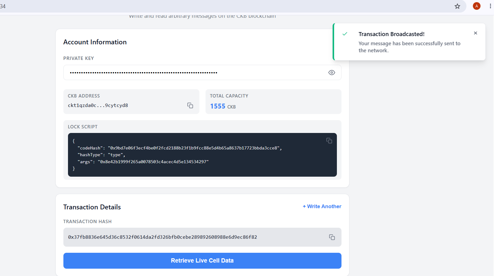
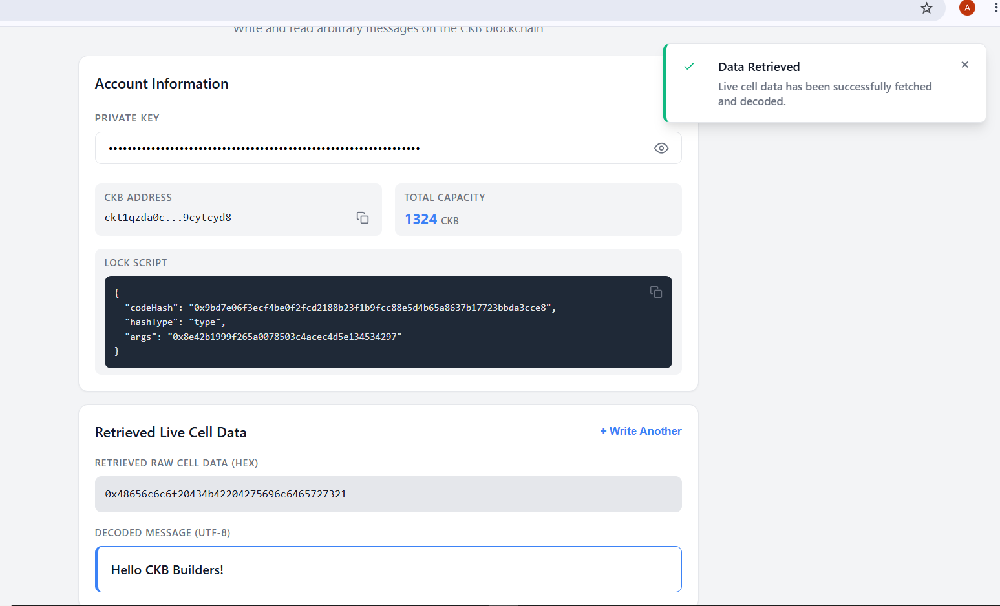

# CKB Store Data on Cell - Quest Proofs

Proof of completion for the **Store Data on Cell** tutorial using a local OffCKB Devnet.

---

## 1. OffCKB Environment Setup

### CLI Installation

Verified that `@offckb/cli` was installed successfully.

### Running Local Devnet

Started the local CKB Devnet.

### Pre-funded Accounts

Listed the pre-funded genesis accounts and retrieved the private key required for testing the dApp.

---

## 2. DApp Execution & Flow

### Start Frontend

Started the frontend development server and opened the application in the browser.

### Message Encoding Preview

Entered a UTF-8 message and verified the generated hexadecimal representation before submitting the transaction.

### Build & Broadcast Transaction

Submitted the transaction by clicking **Write to Chain**, which built, signed, and broadcast the transaction. The generated transaction hash was displayed after submission.

### Retrieve & Decode Cell Data

Retrieved the stored Live Cell through the RPC interface and verified that the stored hexadecimal data could be decoded back into the original UTF-8 message.

