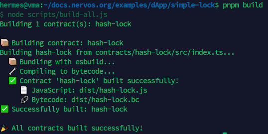
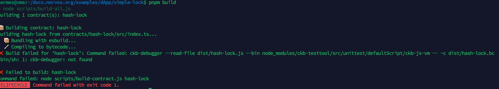
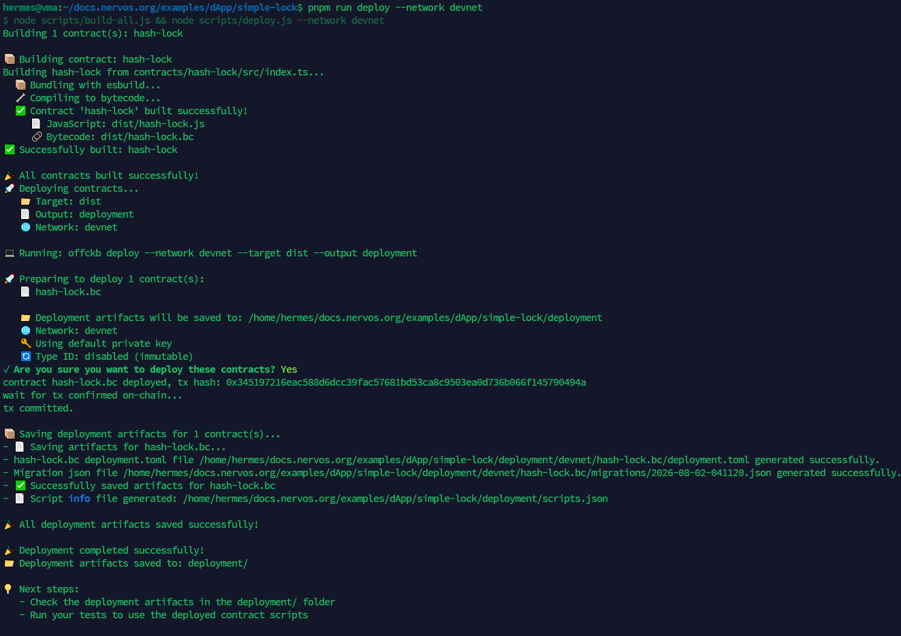
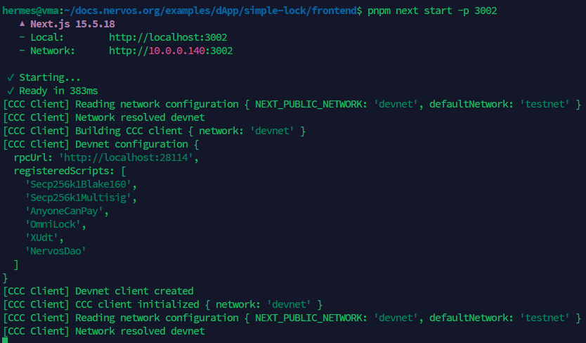
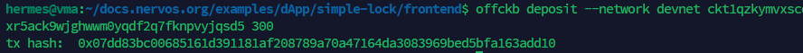
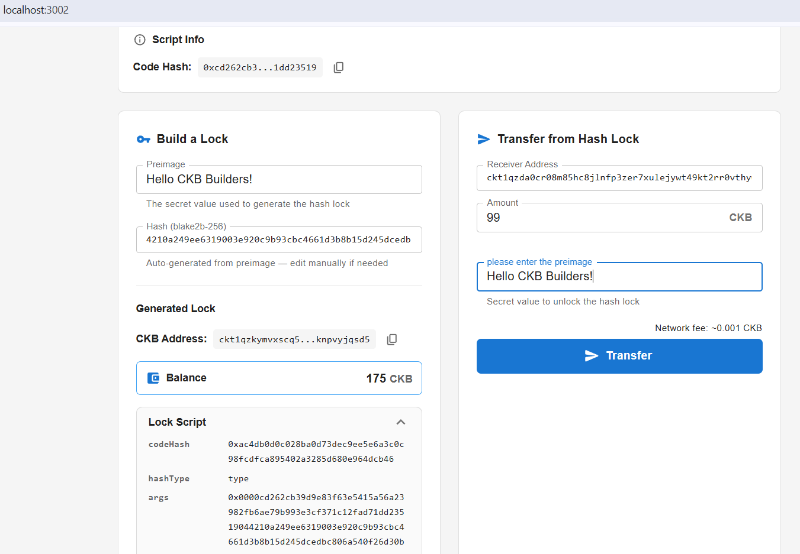
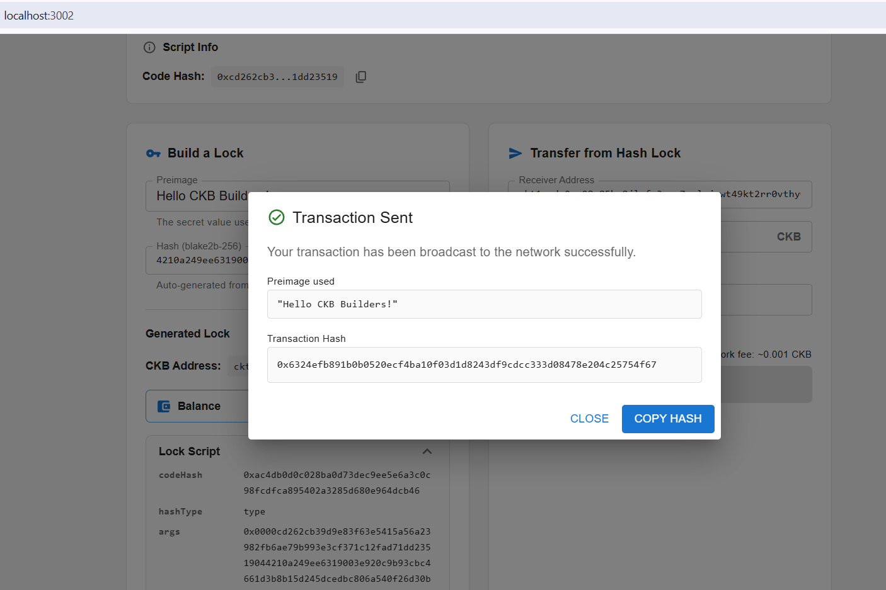

# Build on CKB: Campaign #03

Get started on CKB by completing the **Build a Simple Lock** tutorial.

---

## 1. OffCKB Environment Setup

> **Note:** The OffCKB environment setup (CLI installation, starting the local Devnet, and checking pre-funded accounts) was already completed in Campaign #02. Since the setup process is identical, the screenshots from Campaign #02 are reused here.

### CLI Installation

Verified that `@offckb/cli` was installed successfully.


### Running Local Devnet

Started the local CKB Devnet.


### Pre-funded Accounts

Listed the pre-funded genesis accounts and retrieved the private key required for testing the dApp.


---

## 2. Build and Deploy the Script

### Build the Script

Built the contract using:

```bash
pnpm install
pnpm build
```



> **Issue Encountered & Debugging**
>
> During my first build attempt, `pnpm build` failed with the error `ckb-debugger: not found`. While following the **Build a Simple Lock** tutorial, I couldn't find any mention that `ckb-debugger` needed to be installed before building the contract. After some investigation, I found the **Debug with ckb-debugger** documentation and installed the required tool. Once installed, the build completed successfully.
>
> I think adding a short note or a link to the `ckb-debugger` installation guide in the Simple Lock tutorial would make the onboarding experience smoother for new developers.



### Deploy the Script

Successfully deployed the compiled Lock Script to the local Devnet.

```bash
pnpm run deploy --network devnet
```



---

## 3. DApp Execution & Flow

### Start Frontend

Started the frontend development server and opened the dApp in the browser.



### Deposit CKB

Deposited **300 CKB** into the generated `hash_lock` address using `offckb deposit`. This created the Live Cells required for testing the custom Lock Script.



### Prepare Unlock Transaction

Configured the receiver address and transfer amount in the frontend to prepare an unlock transaction from the custom Lock Script.



### Transfer / Unlock Tokens

Successfully transferred CKB from the `hash_lock` address by providing the correct preimage. This demonstrated that the Lock Script correctly validated the preimage before allowing the transaction to be executed.


