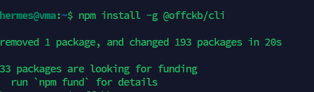
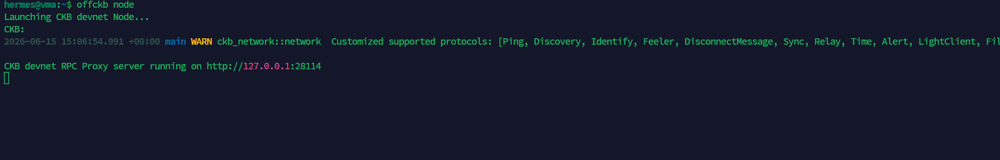
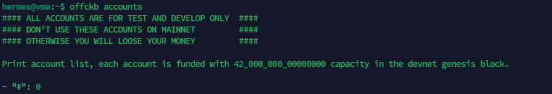
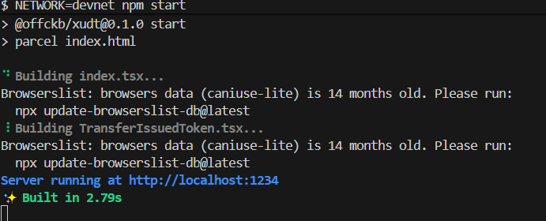
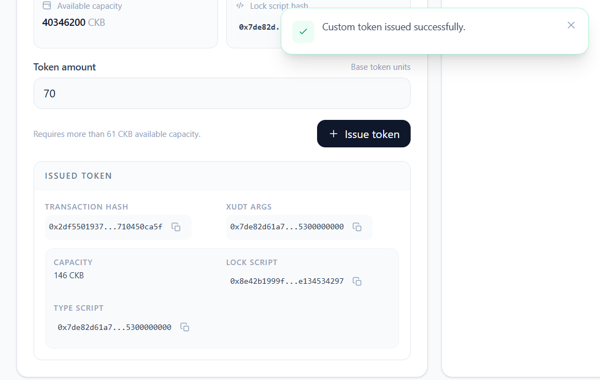
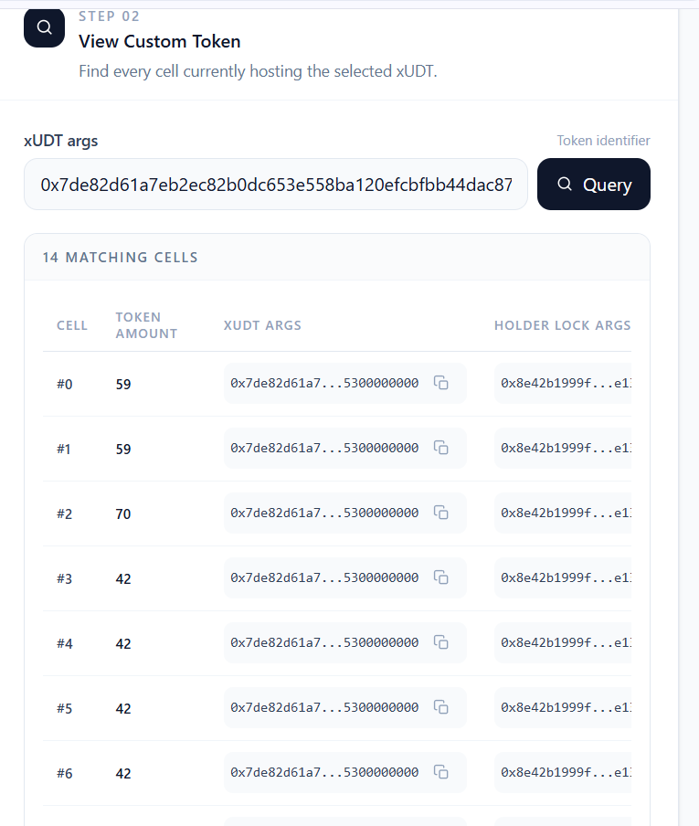
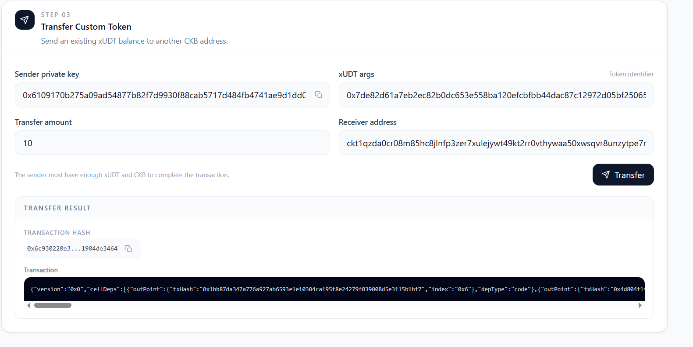

# Build on CKB: Campaign #05

Get started on CKB by completing the tutorial for Campaign #05.

---

## 1. OffCKB Environment Setup

> **Note:** The OffCKB environment setup (CLI installation, starting the local Devnet, and checking pre-funded accounts) was already completed in Campaign #02. Since the setup process is identical, the screenshots from Campaign #02 are reused here.

### CLI Installation

Verified that `@offckb/cli` was installed successfully.

### Running Local Devnet

Started the local CKB Devnet.

### Pre-funded Accounts

Listed the pre-funded genesis accounts and retrieved the private key required for testing the dApp.

---

## 2. DApp Execution

### Running the DApp

Started the frontend development server and successfully ran the dApp in the browser.

---

## 3. Token Operations

### Create Token

Successfully created the token.

### Query Token

Queried the token details and balance.

### Transfer Token

Successfully transferred the token to another address.

